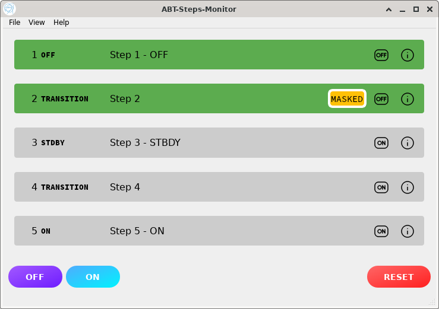
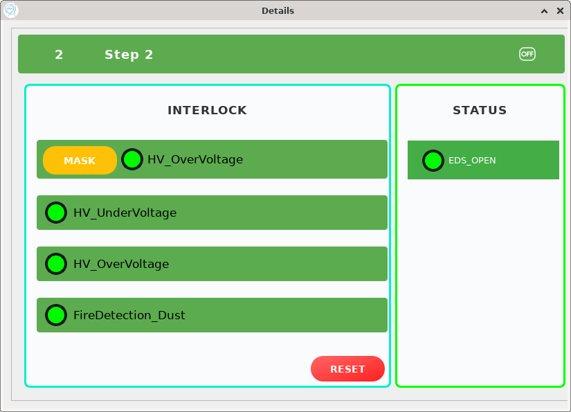

# CERN Beam Control GUI

This repository presents a user interface prototype designed and developed at CERN during my internship within the SY/ABT (Beam Transfer) group in 2025. The application provides real-time control and monitoring functionality for beam transfer devices involved in injection and extraction processes.

**Note**: This repository contains only demonstration UI files and screenshots. The full source code and device communication logic are internal to CERN and not publicly shared.

---

## Project Overview

The goal of this project was to build a flexible, responsive, and maintainable graphical interface to operate and monitor FESA-controlled beamline components. These components include individual state machines ("steps") and central control devices ("core").

The interface is aimed at supporting both operators and engineers by offering a real-time view of system status, command execution, and device-level diagnostics.

---

## My Role and Contributions

I was responsible for designing and implementing the full application structure and user interface from the ground up. This included:

### 1. GUI Architecture and Design

- Designed a modular layout using **PyQt6** and **Qt Designer**, enabling reusability across multiple views.
- Built and connected individual components such as:
  - `OverviewWidget` – shows the full list of devices with ON/OFF access
  - `StepDetailsDialog` – provides deep inspection per device
  - `MainWindowWidget` – global control area for core commands

### 2. Real-Time Command Handling

- Implemented **asynchronous command dispatch** using `asyncio` and `qasync` to handle:
  - Device commands (start, stop, reset)
  - Interlock masking and resets
  - Feedback masking
- Ensured proper FESA protocol compliance using **double-latching/unlatching mechanisms**.

### 3. Device Communication Abstraction

- Developed integration layers to interact with:
  - **Configuration** and **Acquisition** data models
  - Step and core command interfaces via `PyDA` (JAPC client)
- Parsed and transformed raw data into dynamic visual components (status, timers, transitions, etc.).

### 4. Interlock and Feedback System

- Created a detailed interlock visualization system:
  - Mask and acknowledge buttons with live feedback
  - LED-style indicators and status-based row coloring
- Built logic to handle masking rules: masked interlocks allow device start, while still indicating faults.

### 5. Global Control Support

- Added global ON/OFF/RESET buttons for controlling the entire device group.
- Ensured synchronization between global commands and individual step states.

### 6. Project Refactoring

- Refactored all helper modules (`command_helper.py`, `step_state.py`, etc.) for reuse and clarity.
- Applied multiple `FIXME` and `TODO` resolutions to simplify the codebase and reduce duplication.
- Organized code into `src/` layout and abstracted reusable logic into `utils.py`.

---

## Technology Stack

- **PyQt6** – for GUI components and layout
- **Qt Designer** – for visual UI design
- **asyncio** and **qasync** – for non-blocking UI updates and background communication
- **JAPC (Java API for Parameter Control)** – used via `pyda` to interact with CERN FESA devices
- **FESA Explorer** – for dynamic device discovery

---

## Screenshots

### Main Overview Page

_Screenshot of the device overview page, showing interlock/mask status and device state buttons._

### Step Details Page

_Screenshot of an individual device's detail dialog with interlocks, feedbacks, and controls._

---

## Repository Contents

This repository includes:

- `src/ui/` – UI design files created in Qt Designer
- `prev_overview.png` / `prev_details.png` – sample screenshots for documentation and demonstration
- `README.md` – project description (this file)

**No logic or device interaction code is publicly included.**

---

## License

No open-source license is applied to this repository. The UI designs and visuals are provided for reference and demonstration only. For usage or reuse, please contact the author.

---

## Contact

Feel free to reach out via GitHub or LinkedIn for questions or collaboration.
